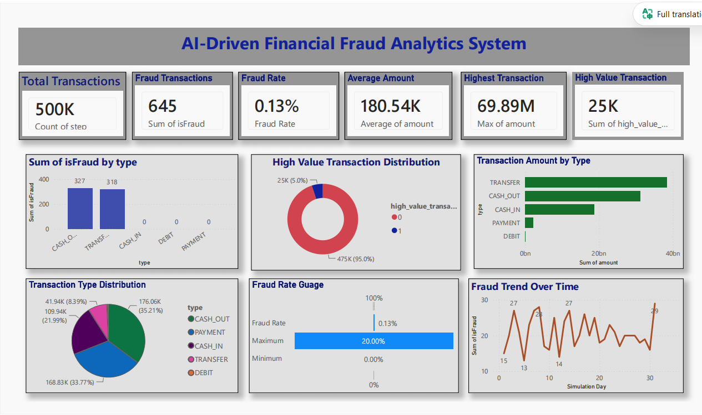
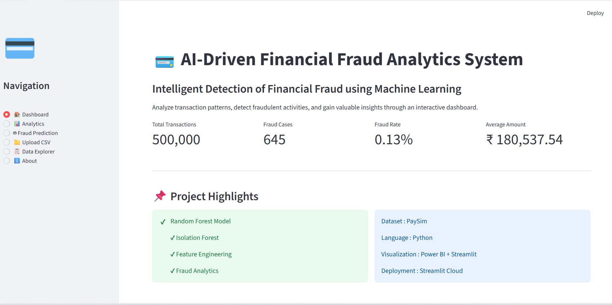
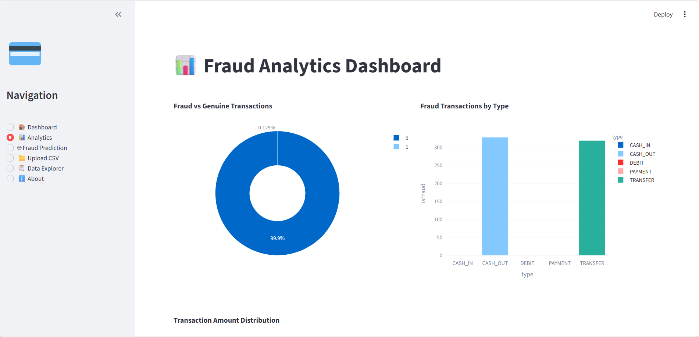
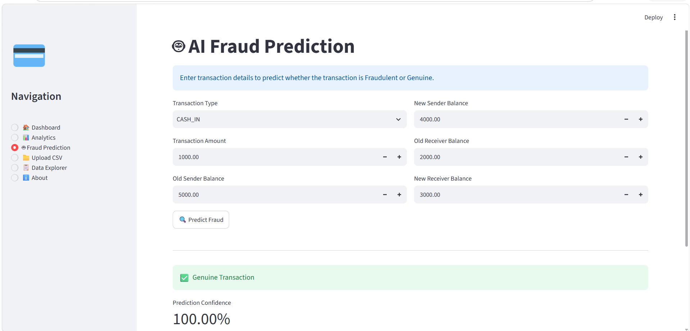
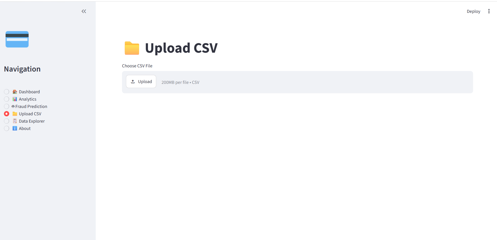
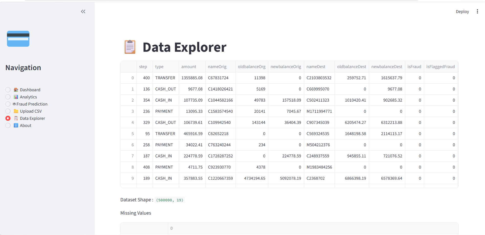
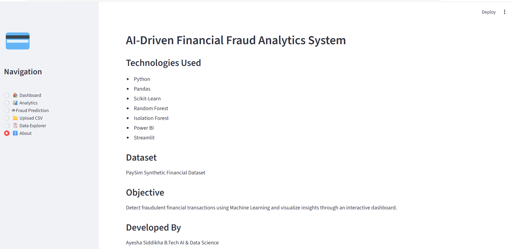

# 🛡️ AI-Driven Financial Fraud Analytics System

<p align="center">
  
</p>


# 🚀 Project Overview

Financial fraud has become one of the most significant challenges in today's digital banking ecosystem. Millions of financial transactions occur every day, making manual fraud detection inefficient and time-consuming.

This project presents an **AI-Driven Financial Fraud Analytics System** that combines **Machine Learning, SQL, Power BI, Streamlit, and Business Intelligence** to detect fraudulent financial transactions, analyze fraud patterns, and provide real-time predictive analytics.

The system leverages the **PaySim Financial Dataset** to preprocess transaction data, engineer meaningful features, train Machine Learning models, generate SQL-based business insights, build interactive Power BI dashboards, and deploy an intuitive Streamlit web application for fraud prediction.

This project demonstrates how Artificial Intelligence can assist financial institutions in improving fraud detection, minimizing financial losses, and supporting data-driven decision-making.

# ✨ Project Highlights

✅ AI-powered Financial Fraud Detection

✅ Machine Learning-based Fraud Prediction

✅ Advanced Feature Engineering

✅ Exploratory Data Analysis (EDA)

✅ SQL-based Fraud Analytics

✅ Interactive Power BI Dashboard

✅ Streamlit Web Application

✅ Real-time Fraud Prediction

✅ Business Intelligence Reporting

✅ Generative AI Future Scope

# 🎯 Key Features

- 🔍 Detects fraudulent financial transactions using Machine Learning.
- 📊 Interactive Power BI dashboard for fraud analytics.
- 📈 Exploratory Data Analysis with meaningful visualizations.
- 🧠 Feature Engineering for improved prediction accuracy.
- 💾 SQL queries for financial fraud analysis.
- 🌐 Streamlit application for real-time fraud prediction.
- 📂 Upload CSV datasets for prediction.
- 📋 Interactive data explorer.
- ⚡ Risk analysis with prediction confidence.
- 🤖 Future-ready architecture supporting Generative AI integration.

# 🛠️ Tech Stack

| Category | Technologies |
|-----------|-------------|
| Programming Language | Python |
| Machine Learning | Scikit-learn |
| Data Analysis | Pandas, NumPy |
| Data Visualization | Matplotlib, Seaborn |
| Business Intelligence | Microsoft Power BI |
| Database | SQL |
| Web Framework | Streamlit |
| IDE | Visual Studio Code |
| Version Control | Git & GitHub |

# 📂 Project Structure

```text
AI-Driven-Financial-Fraud-Analytics-System/
│
├── 📂 data
│   ├── raw
│   ├── processed
│   └── sample
│
├── 📂 models
│   ├── fraud_detection_model.pkl
│   ├── random_forest_model.pkl
│   ├── isolation_forest_model.pkl
│   └── label_encoder.pkl
│
├── 📂 notebooks
│   ├── 01_Project_Setup_And_Data_Understanding.ipynb
│   └── 02_Data_Preprocessing_And_Model_Building.ipynb
│
├── 📂 outputs
│   └── charts
│
├── 📂 powerbi
│   └── Financial_Fraud_Analytics_Dashboard.pbix
│
├── 📂 python
│   ├── data_preprocessing.py
│   ├── feature_engineering.py
│   ├── train_model.py
│   └── utils.py
│
├── 📂 reports
│
├── 📂 sql
│   └── fraud_analysis_queries.sql
│
├── 📂 assets
│
├── app.py
├── requirements.txt
├── README.md
└── .gitignore
```

# 🔄 Project Workflow

```text
📊 PaySim Dataset
        │
        ▼
🧹 Data Cleaning & Preprocessing
        │
        ▼
⚙️ Feature Engineering
        │
        ▼
📈 Exploratory Data Analysis
        │
        ▼
🤖 Machine Learning Model
(Random Forest & Isolation Forest)
        │
        ▼
📊 SQL Analytics
        │
        ▼
📉 Power BI Dashboard
        │
        ▼
🌐 Streamlit Web Application
        │
        ▼
🛡️ Real-Time Fraud Prediction
```

# 🤖 Machine Learning Pipeline

The project follows a structured Machine Learning workflow to accurately identify fraudulent financial transactions.

### Data Preparation

- Data Cleaning
- Missing Value Verification
- Duplicate Record Checking
- Label Encoding
- Feature Scaling (where required)

### Feature Engineering

Custom features were generated to improve prediction performance:

- Balance Origin Difference
- Balance Destination Difference
- Amount-to-Balance Ratio
- High Value Transaction Flag
- Zero Balance Sender
- Zero Balance Receiver

### Models Implemented

- 🌳 Random Forest Classifier
- 🌲 Isolation Forest

### Model Evaluation

The models were evaluated using:

- Accuracy
- Precision
- Recall
- F1-Score
- ROC Curve
- Confusion Matrix

# ✨ Role of Generative AI

Although the core fraud prediction system is powered by Machine Learning, this project also explores the potential role of **Generative AI** in modern financial analytics.

Future enhancements can integrate Large Language Models (LLMs) to:

- 🤖 Generate automated fraud investigation reports
- 📑 Summarize suspicious transaction patterns
- 💬 Build AI-powered fraud assistance chatbots
- 📊 Explain Machine Learning predictions in natural language
- ⚠️ Generate intelligent fraud prevention recommendations
- 📈 Assist financial analysts with automated business insights

The combination of predictive Machine Learning and Generative AI can create more intelligent, explainable, and user-friendly fraud detection systems.

# 📊 Dataset

| Attribute | Details |
|-----------|----------|
| Dataset | PaySim Synthetic Financial Dataset |
| Domain | Financial Fraud Detection |
| Records Used | 500,000 |
| Features | 19 |
| Target Variable | isFraud |

### Key Attributes

- Transaction Type
- Transaction Amount
- Sender Balance
- Receiver Balance
- Fraud Label
- Transaction Time
- Engineered Features

  # 📈 Exploratory Data Analysis

The project includes comprehensive exploratory data analysis to understand transaction behavior and fraud characteristics.

### Analysis Performed

- Fraud Distribution
- Transaction Type Analysis
- Transaction Amount Analysis
- Correlation Analysis
- Feature Importance
- Transaction Trend Analysis
- Fraud Pattern Identification

These insights guided feature engineering and improved Machine Learning performance.

# 📊 SQL Analytics

SQL queries were developed to extract valuable fraud-related business insights.

### Analysis Includes

- Total Transactions
- Fraud Rate
- Fraud by Transaction Type
- Daily Fraud Summary
- High Value Transactions
- Balance Analysis
- Fraud Trend Analysis
- Business Reports

  # 📊 Power BI Dashboard

The project includes an interactive **Microsoft Power BI Dashboard** that provides real-time insights into financial transactions and fraud patterns.

### Dashboard Highlights

- 📌 Total Transactions
- 🚨 Fraud Transactions
- 📈 Fraud Rate
- 💰 Average Transaction Amount
- 📊 Transaction Type Distribution
- 📉 Fraud Trend Analysis
- 🎯 High Value Transaction Analysis

## Dashboard Preview

> 📷 Replace the image below after uploading it to the `assets` folder.



# 🌐 Streamlit Web Application

A responsive web application was developed using **Streamlit** to provide real-time fraud prediction and interactive analytics.

## Modules

### 🏠 Dashboard

Provides an overview of project statistics and fraud metrics.



---

### 📊 Analytics

Interactive visualizations for fraud analysis and transaction insights.



---

### 🤖 Fraud Prediction

Predicts whether a transaction is **Fraudulent** or **Genuine** using the trained Random Forest model.



---

### 📂 Upload CSV

Allows users to upload transaction datasets for batch analysis.



---

### 🔍 Data Explorer

Explore dataset records, dimensions, and missing values.



---

### ℹ️ About

Displays project overview, technologies used, and developer information.



# 🚀 Installation

Clone the repository

```bash
git clone https://github.com/YOUR_USERNAME/AI-Driven-Financial-Fraud-Analytics-System.git
```

Move into the project folder

```bash
cd AI-Driven-Financial-Fraud-Analytics-System
```

Install dependencies

```bash
pip install -r requirements.txt
```

Run the application

```bash
streamlit run app.py
```

# 📦 Required Libraries

- Streamlit
- Pandas
- NumPy
- Scikit-learn
- Matplotlib
- Seaborn
- Plotly
- Joblib

# 📈 Results

✔ Successfully detected fraudulent financial transactions using Machine Learning.

✔ Developed an interactive Power BI dashboard for fraud analytics.

✔ Built a Streamlit web application for real-time prediction.

✔ Implemented SQL queries for business insights.

✔ Applied feature engineering to improve prediction capability.

✔ Demonstrated the integration of Machine Learning, Business Intelligence, and interactive web technologies into a unified fraud analytics solution.

# 🔮 Future Enhancements

- 🤖 Integrate Large Language Models (LLMs) for explainable AI.
- 💬 AI-powered fraud investigation assistant.
- ☁️ Cloud deployment using AWS or Azure.
- 📱 Mobile-friendly fraud monitoring application.
- 🔄 Real-time streaming fraud detection using Apache Kafka.
- 🧠 Deep Learning-based fraud detection models.
- 📡 API integration with banking systems.
- 📈 Advanced predictive analytics and anomaly detection.

# 👩‍💻 Author

**Shaik Ayesha Siddikha**

Final-Year B.Tech Student (Artificial Intelligence & Data Science)

📌 Passionate about Data Analytics, Artificial Intelligence, Machine Learning, and Business Intelligence.

- 💼 LinkedIn: www.linkedin.com/in/ayesha-siddikha-shaik-b4212a330
- 💻 GitHub: https://github.com/AyeshaSiddikhaShaik
- 📧 Email: ayesha.shaik.siddikha@gmail.com

# 🙏 Acknowledgements

This project was developed as part of an internship focused on applying Artificial Intelligence, Machine Learning, SQL, Power BI, and Streamlit to solve real-world financial fraud detection problems.

Special thanks to the mentors, internship organizers, and the open-source community for providing valuable learning resources and tools.

# ⭐ Support

If you found this project helpful, consider giving it a ⭐ on GitHub.

Your support motivates me to continue building and sharing impactful AI and Data Analytics projects.
